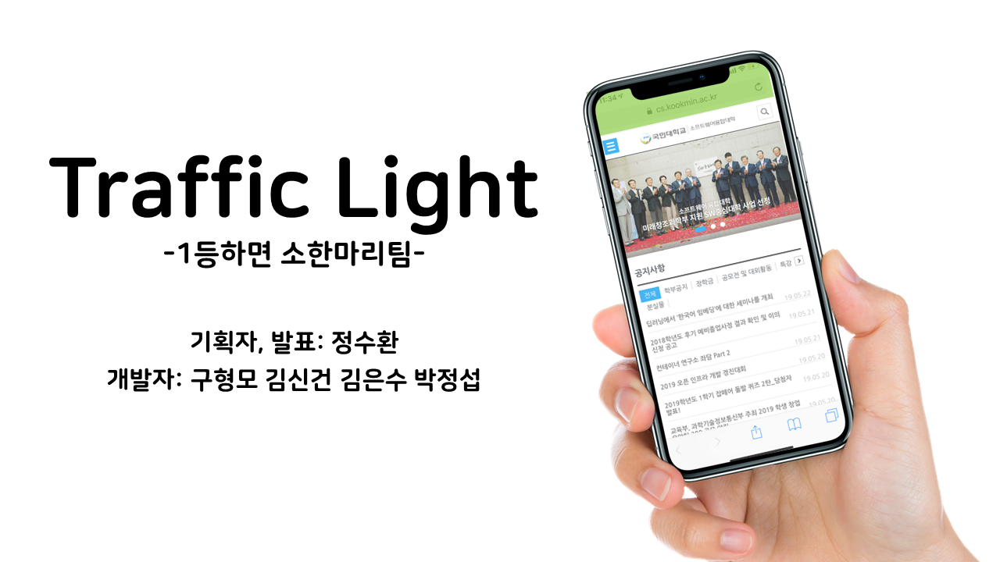
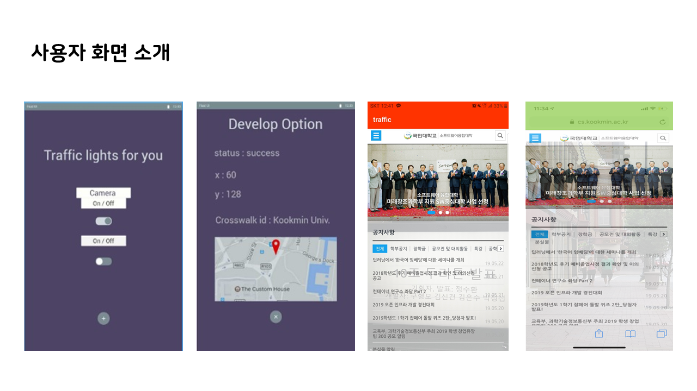

# Traffic Light
TLFK (Traffic Light)

- 국민대학교에서 24시간 동안 진행한 해커톤입니다.
- 어린이들이 횡단보도를 건너면서 혹은 건너기 전에 기다리며 스마트폰을 보다가 나는 사고를 방지하기 위해 기획한 앱입니다.
- 위 앱으로 장려상🥉과 상금 10만원💰 수상하였습니다.

## 팀원
- 구형모(Client,Server), 김신건(Server), 김은수, 박정섭(Client), 정수환

## 슬라이드

[데모영상](https://github.com/ParkJeongseop/TLFK/blob/master/Docs/Demo%20Video.MOV)

## 수상
제 4회 국민대학교 두리톤 장려상 수상

